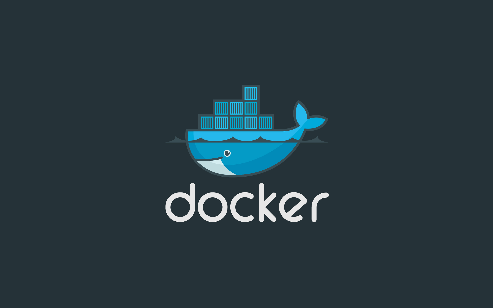

# Docker教程(完整版本请下载本项目中的pdf或HTML文件)

## 0. Docker image上传DockerHub
>1. 将自己已修改了的image镜像进行commit操作：`docker commit -m="提交的描述信息" -a="作者" 容器id 目标镜像名:[TAG]`
>2. 在命令行登录自己的Docker账号： `docker login -u DockerHubUserName`，如果在commit阶段将目标镜像名以DockerHub上传的形式进行修改的话，也即：`目标镜像名=DockerHubUserName/imagename:tagid`，那么第三步则可以跳过，不需要再经过打标签的方式修改镜像名为DockerHub需要的形式；
>3. 给自己的image添加tag，其中image的名称需要加上自己的DockerHub用户名前缀：`docker tag imageid DockerHubUserName/imagename:tagid`
>4. 将加上了tag信息的image上传到DockerHub：`docker push DockerHubUserName/imagename:tagid`
>5. 在其他电脑上需要下载某个已上传的镜像时：`docker pull DockerHubUserName/imagename:tagid`

## 1. Docker概述

1. [Ubuntu18.04 安装docker 教程一；](https://blog.zenghr.cn/passages/2020-02-24-docker-install.html)
2. [Ubuntu18.04 安装docker 教程二；](https://www.cnblogs.com/ellisonzhang/p/13902451.html)
3. **Docker核心思想：打包装箱、互相隔离、开发打包部署一套上线；**
4. **容器化技术不是模拟的一个完整的操作系统！容器与虚拟机的区别：**

> - 传统虚拟机会虚拟出一条硬件，运行一个完整的操作系统，然后在这个系统上安装和运行软件；
> - 容器内的应用直接运行宿主机的内容，容器是没有自己的内核的，也没有虚拟相应的硬件，所以很轻便，运行速度更快，相关的应用更快速的交付和部署；
> - 每个容器间是相互隔离的，每个容器内都有一个属于自己的文件系统，互不影响，更快捷的升级和扩缩容；
> - docker是内核级别的虚拟化，可以在一个物理机上运行很多的容器实例，服务器的性能够被压榨到极致；

5. **Docker架构图：**
>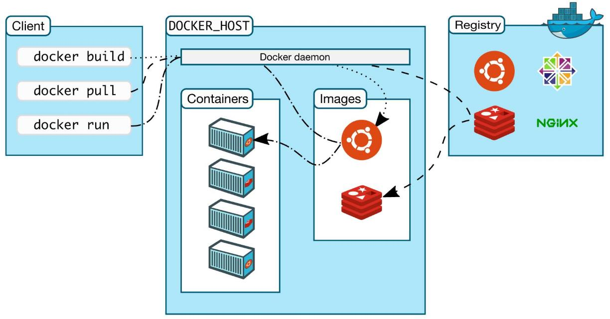
6. **Docker相关名词：**

>- **镜像(image)**：docker镜像好比是一个模板，可以通过这个模板来创建容器服务，比如: tomcat服务-->run-->tomcat01容器(提供服务), 通过这个镜像可以创建多个容器(最终服务或者项目运行就是在这个容器中的)；
>- **容器(container)**：Docker利用容器技术，独立运行一个或者一组应用，通过镜像来创建。目前可以把这个容器理解为简易的Linux系统；
>- **仓库(repository)**：仓库就是存放镜像的地方，仓库分为共有仓库和私有仓库，例如DockerHub或者国内的阿里云等都有容器服务；

7. **docker默认工作路径：**`sudo ls /var/lib/docker/`
8. **阿里云镜像加速：**

9. **Docker运行一个镜像的步骤：**

10. **Docker是怎么工作的？**

> Docker是一个Client-Server结构的系统，Docker的守护进程是运行在宿主机上的，通过Socket从客户端访问，DockerServer接收到DockerClient的指令后就会执行这个命令！
> 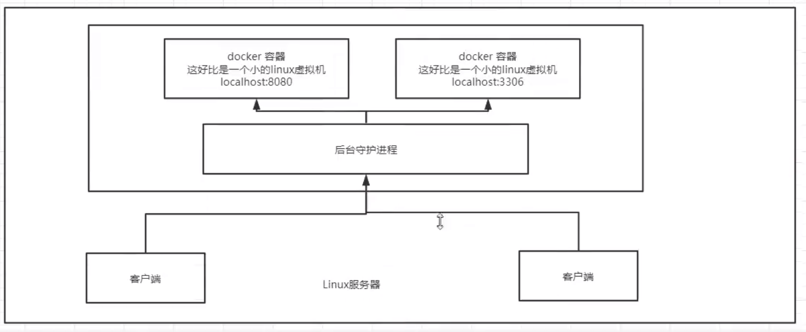

11. **Docker为什么比VM快？**

> - Docker有着比虚拟机更少的抽象层；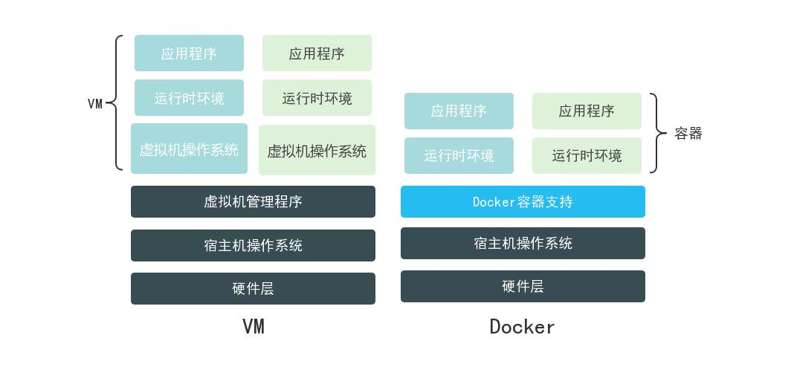
> - Docker利用的是宿主机的内核，VM则需要自己建立虚拟机操作系统，所以新建一个容器的时候，不需要像虚拟机一样重新加载一个操作系统内核，避免引导，省略了这个复杂的过程，速度是秒级的；

12. **Docker服务的启动与停止：**

> - `sudo systemctl start docker`，启动docker；
> - `sudo systemctl stop docker`，停止docker；
> - `sudo systemctl restart docker`，重启docker；
> - `sudo systemctl status docker`，查看docker状态；
> - `sudo systemctl enable docker`，开机启动docker；

## 2. 镜像的基本命令

### 2.1 帮助命令

> - `docker version` #显示docker的版本信息
> - `docker info` # 显示docker的系统信息，包括镜像和容器的数量
> - `docker command_line --help` # 帮助命令
> - **帮助文档地址**： https://docs.docker.com/engine/reference/commandline/

### 2.2 镜像命令

1. `docker images` 查看所有本地主机上的镜像

> 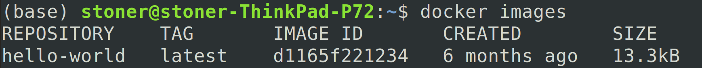
>
>- **REPOSITORY**: 镜像的仓库源；
>- **TAG**: 镜像的版本标签信息；
>- **IMAGE ID**: 镜像的id；
>- **CREATED**: 镜像创建时间；
>- **SIZE**: 镜像的大小；
>- `-a` : 可选项，列出所有镜像；
>- `-q` : **-q, --quiet, Only show image IDs**, 可选项，只显示镜像的id；

2. `docker search` 搜索镜像
> `--filter=STARS=3000` # 可选项，搜索镜像的STARTS大于3000的；

3. `docker pull` 下载镜像

> - **下载镜像：**`docker pull 镜像名[:tag]`
> - 如果不指定`tag`的具体版本的话，则默认下载的是**latest**；
> - 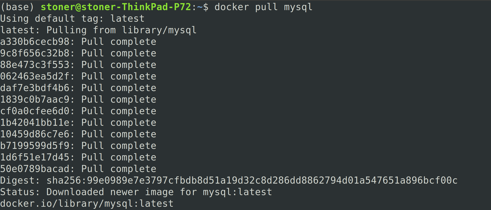
> - **pull complete那一行是分层下载，是docker images的核心，联合文件系统**；
> - **Digest那一行是该镜像的签名信息，防伪；**
> - **`docker.io/library/mysql:latest`**是**image**的真实地址，因此**`docker pull mysql`**与**`docker pull docker.io/library/mysql:latest`**是等价的；
> - **如果要下载指定版本的话，可以在DockerHub中找到要下载的镜像有什么版本，然后在拉取镜像的时候进行版本指定，例如：`docker pull mysql:5.7`**
> - 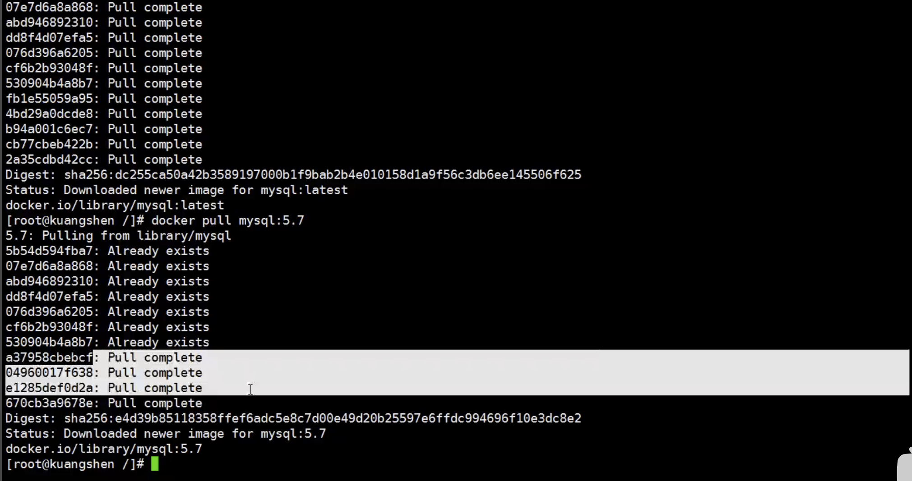
> - **可以看到分层下载的好处就是，下载不同的版本的时候，之前下载的版本的image中有些跟现在下载的版本的image中有共用的内容的时候就不用再下载了，这就是联合文件系统**；

4. `docker rmi`删除镜像

> - `docker rmi 镜像名/镜像id`，删除单个指定的容器
> - `docker rmi -f 镜像名/镜像id`，其中 `-f`代表的是将要删除的image完全删除干净，后面可以接多个镜像，就会删除多个指定的镜像；
> - `docker rmi -f $(docker images -aq)`，递归的删除所有的镜像，其中 `$(docker images -aq)`就是查找到所有的**images**，其中`-a`代表列出所有的镜像，`-q`代表只列出镜像的**ID**号；

## 3. 容器的基本命令

1. **需要注意的是有了镜像才能够创建容器，可以下载一个ubuntu系统来测试学习；**

> `docker pull ubuntu`

2. **新建容器并启动：**
```shell
docker run [可选参数] image_name
- --name="Name" # 容器名字，例如：tomcat01、tomcat02用以区分不同的容器；
- -d #以后台方式运行, 并返回容器ID；
- -i #参数i是keep STDIN open even if not attached，意思就是会把交互界面保留着。但是要看容器的PID1，或者说看容器的CMD是什么，有些CMD程序并不会理会任何输入，也就是说它就没有等着你输入命令，这时候你输入什么都是无效的。并且，因为linux对pid1的特殊处理，它也不会理会信号，所以你只能按ctrl+p + ctrl+q，把程序放到后台。（但通常都要run -it一起使用才有效）;
- -t #allocate a pseudo-TTY.作用是分配一个虚拟的终端，我的理解就是，有了-t参数，这个docker就会被分配一个终端，在docker中启动bash就会有提示符。不过，-it总是一起出现的，为容器重新分配一个为输入终端，通常与-i同时使用;
- -it # 使用交互方式运行，进入容器查看内容；
- -p # 指定端口映射，格式为：主机port:容器port, `-p 主机端口:容器端口(常用)`，这种方式就将外部主机的端口与容器的端口进行绑定(映射)，从而通过主机的被绑定的端口可以访问容器的端口；
- -P # 随机指定端口；
```

3. **启动并以交互模式(`-it`)进入容器：`docker run -it ubuntu /bin/bash`**
> 
> 此时开启的ubuntu容器与外部的没有任何关系，属于基础版本，很多命令并不完善。
>上述命令中的`/bin/bash`的作用是表示载入容器后运行bash, docker中必须要保持一个进程的运行，要不然整个容器启动后就会马上kill itself，这个/bin/bash就表示启动容器后启动bash。

3.1 **简单的例子**
>https://www.cnblogs.com/frankcui/p/18293407，以下面的例子为例：
```
docker run -it centos /bin/bash
首先，docker run -it centos 的意思是，为centos这个镜像创建一个容器，-it就等于 -i和-t，这两个参数的作用是，为该docker创建一个伪终端，这样就可以进入到容器的交互模式？（也就是直接进入到容器里面），后面的/bin/bash的作用是表示载入容器后运行bash ,docker中必须要保持一个进程的运行，要不然整个容器启动后就会马上kill itself，这个/bin/bash就表示启动容器后启动bash。
```

3.2 **复杂的例子**
```
docker run 
--name optz_service               //给容器命名
-it                               //打开一个交互式终端
-p 60003:60003                    //容器内端口，映射到主机端口
-v /opt/copt65:/opt/copt65        //容器内路径，挂载到主机路径
-v /app/optz_service/logs:/app/optz_service/logs 
-u appadmin                       //指定执行命令时，所使用的用户
-d                                //后台运行容器，并返回容器ID
optz_service:latest               //镜像名:版本号
/bin/bash                         //启动容器后启动bash,docker容器必须要保持一个进程的运行, 要不然整个容器启动后就会马上kill itself
/app/optz_service/bin/startup.sh  //在bash里运行的命令
 >/dev/null                       //丢弃输出信息
 2>&1                             //将标准错误消息流2，重定向到标准信息流1（但均会被丢弃）
 &                                //最后的&，让bash在后台执行
```

4. **查看当前有哪些容器是在运行的：`docker ps`，查看现在正在运行的容器+曾经有哪些容器运行过：`docker ps -a`；要显示最近创建的容器的时候可以使用 `docker ps -a -n=xxx`(-n, --last, int        Show n last created containers (includes all states) (default -1))；只显示容器的编号使用 `-q`**

> 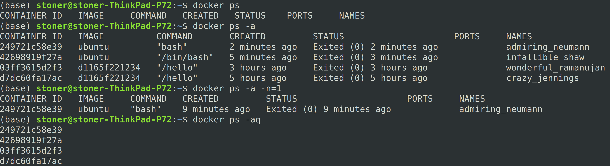
> **个人理解(不一定对)：容器和镜像的关系有点像进程和代码的关系，代码是一堆固定的死的内容，当代码运行起来了之后变成了一个独立的进程，而这个进程除了包含代码本身之外，还包含了运行这个进程所需的一些资源，例如：内存、键盘、鼠标等，而容器和镜像的关系也是类似如此，镜像是死的，镜像运行起来了之后(**`docker run xxximage`**)才变成了容器，而容器除了镜像本身之外还包含了其他资源；**

4.1 https://blog.csdn.net/claram/article/details/104228727; https://www.cnblogs.com/jun-zhou/p/14415800.html

5. **退出容器：**

> - `exit` #退出容器并停止容器；
> - `ctrl + P + Q` # 不停止容器的情况下退出当前容器(不分大小写)；
> - 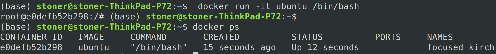

6. **删除容器：**

> - `docker rm 容器id/容器名称`，删除单个指定的容器，但是不能删除正在运行的容器，如果要强制删除使用 `rm -f`的方式进行删除；
> - `docker rm -f $(docker ps -aq)`，递归删除所有容器；
> - `docker ps -a -q | xargs docker rm`，以管道的方式一个一个的进行删除；

7. **启动和停止容器：**

> - `docker start 容器id`，启动容器；
> - `docker restart 容器id`，重启容器；
> - `docker stop 容器id`，停止当前正在运行的容器；
> - `docker kill 容器id`，强制停止当前正在运行的容器；
> - **需要注意的是：`docker run`只有在第一次运行的时候，将镜像放到容器中，以后再次启动这个容器的时候，只需要使用命令 `docker start`就可以了**；

## 4. 日志、元数据以及进程的查看

1. `docker run -d xxximages`，后台启动容器；

> 需要注意：通过后台启动的方式发现 `docker ps`下该容器停止了。这是一个常见的坑：docker容器通过后台运行，就必须要有一个前台进程，当docker发现没有前台的进程的时候就会自动停止当前这个启动的容器；这里的解决办法是在最后加上 `/bin/bash`，`/bin/bash`的作用是表示载入容器后运行**bash** ,**docker**中必须要保持一个进程的运行，要不然整个容器启动后就会马上**kill itself**，这个 `/bin/bash`就表示启动容器后启动**bash**；

2. `docker logs`，查看日志；

> - `docker logs -f -t --tail nums 容器id`；显示容器相关日志，其中 `--tail nums`代表要显示的日志条数；

3. **查看容器中的进程信息：**

> - `docker top 容器id`，查看某个容器的进程信息
> - 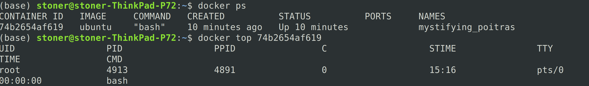

4. **查看镜像元数据：**

> - `docker inspect 容器id`，查看容器的元数据
> - 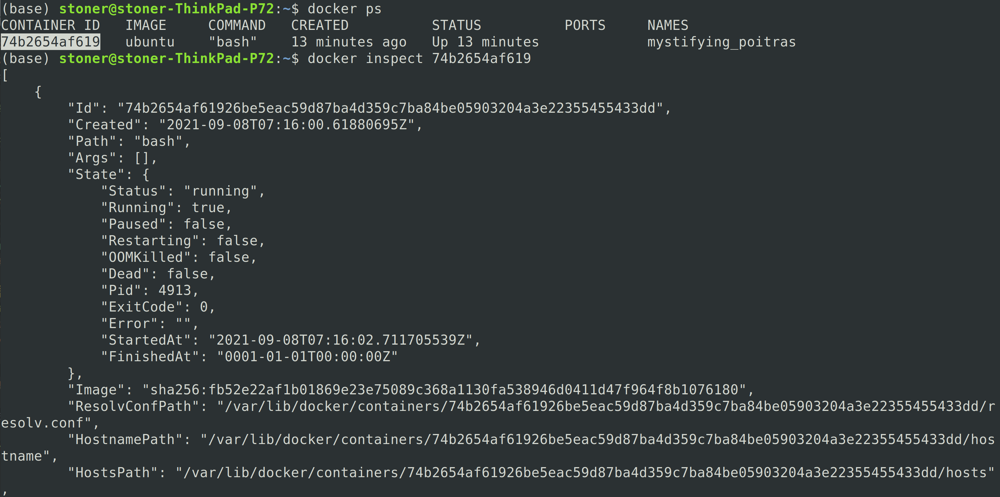

## 5. 进入容器的命令和拷贝命令

1. 方式一：`docker exec -it 容器id bashshell`
> 我们通常容器都是使用后台方式运行的，需要进入容器，修改一些配置；
> 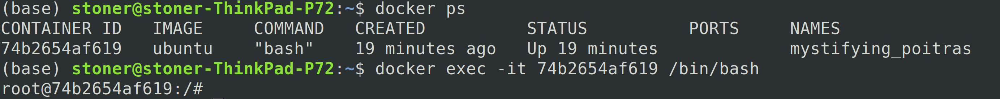

2. 方式二：`docker attach 容器id`
> - `docker exec`进入容器后会开启一个新的终端，可以在里面操作(常用)；
> - `docker attach`进入容器正在执行的终端，不会启动新的进程；
3. 需要注意的是：
- `docker exec <container> some_execute_command`表示在容器中执行命令，那么在容器中执行什么命令呢，就由后面的参数**some_execute_command**决定的, /bin/bash是Linux的一种常用shell脚本，用于解释执行Linux命令，根据镜像支持的shell的不同，可以使用不同的的shell脚本。所以结合起来我们知道这个命令是用于在支持/bin/bash脚本的容器中执行相应命令。例如： 执行docker exec -it ubuntu /bin/bash 就会进入ubuntu容器的/bin/bash脚本执行模式，这时候就相当于登录到容器内部，可以通过shell和这个容器即ubuntu交互，可以执行各种Linux命令了;
- `docker exec -it <container> some_execute_command`：exec是用来让已经运行容器跑一个some_execute_command的程序，需要注意的是，exec命令能够使用起来的前提是`<container>`已经运行起来了，否则无法执行exec命令。


3. **从容器拷贝文件到主机：**
> - `docker cp 容器id:容器内文件路径 主机目的路径`，需要注意的是容器此时是否启动是不重要的，因为容器中的文件是不会消失的，除非容器被删除；
> - 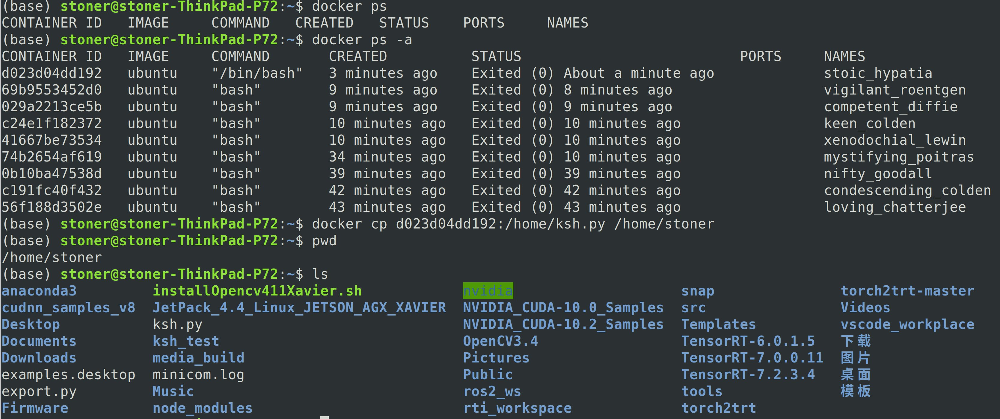
> - **拷贝是一个手动的过程，未来可以使用-v卷的技术实现自动同步。**

## 6. 命令小结

> 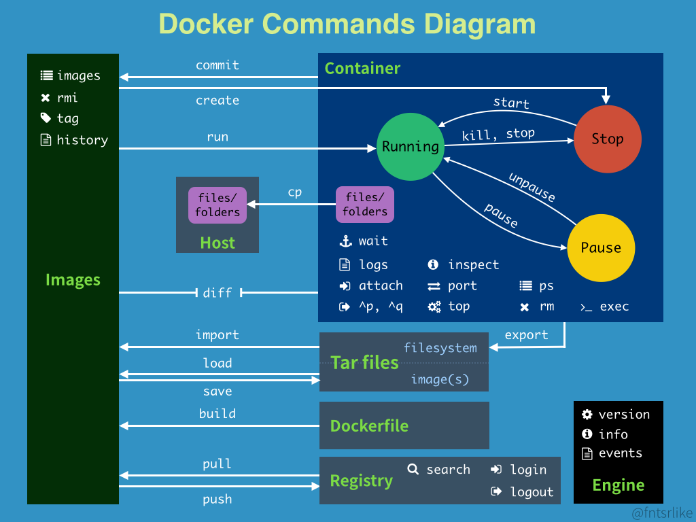
> 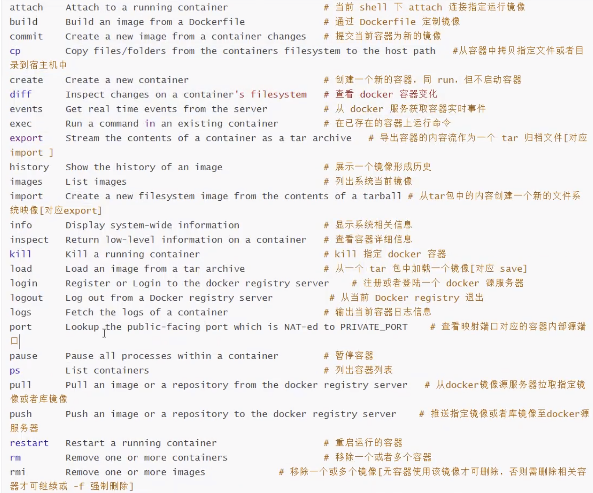
> 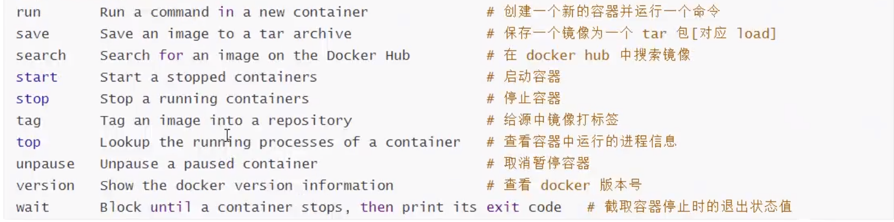
> 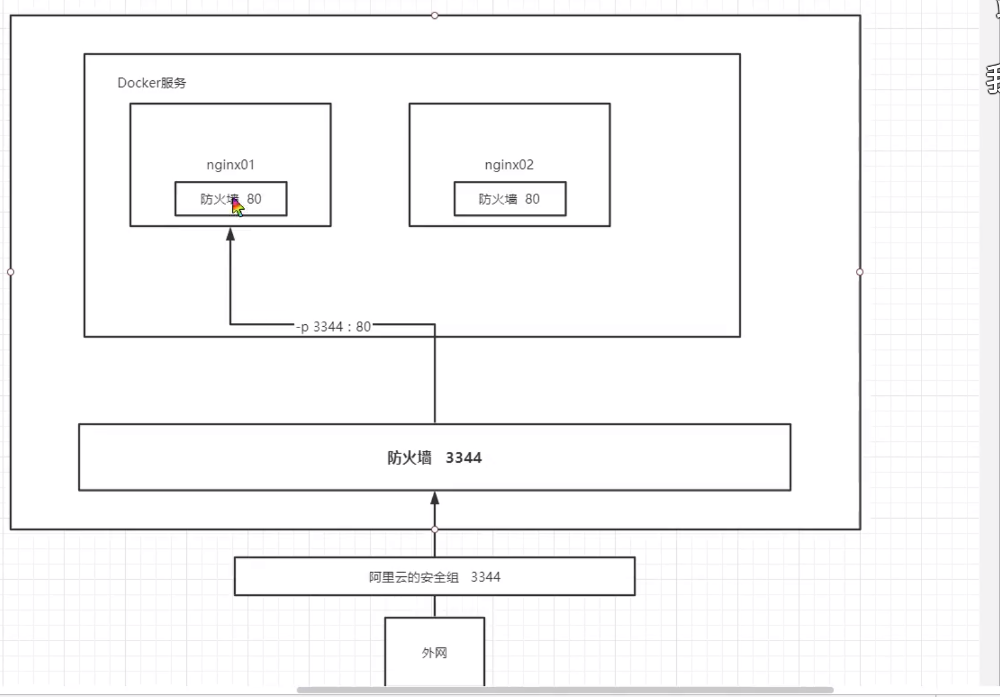
> **需要注意的是我们一般在开启一个容器的时候都是采用的后台启动**，**在停止了这个容器之后还能再查到这个容器**，**如果加上`--rm`这个可选参数之后**，**可以使得该容器在测试完毕之后即被删除**；

## 7. 镜像原理之联合文件系统

### 7.1 什么是镜像

镜像是一种轻量级、可执行的独立软件包，用来打包软件运行环境和基于运行环境开发的软件，它包含运行某个软件所需要的所有内容，包括代码，运行时（一个程序在运行或者在被执行的依赖）、库，环境变量和配置文件。
如何获取一个镜像：

- **从远程仓库下载；**
- **从他人那里拷贝一份；**
- **自己制作一个镜像DockerFile；**

### 7.2 Docker镜像加载原理

#### 7.2.1 UnionFS(联合文件系统)

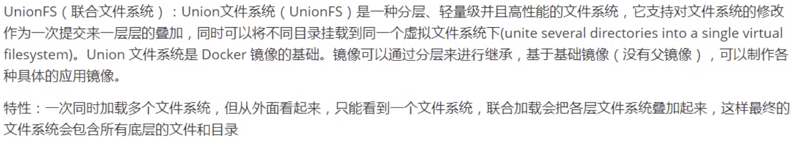

#### 7.2.2 Docker镜像加载原理

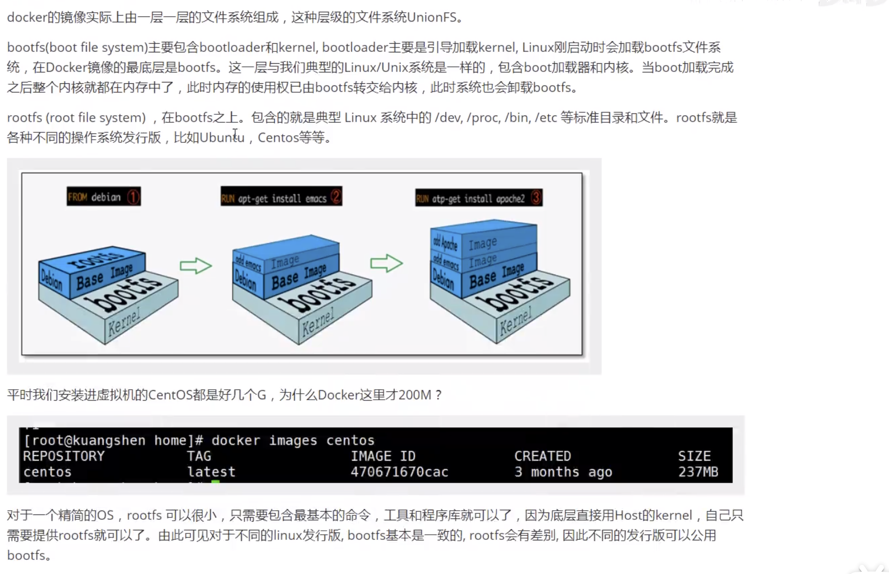

> 在docker中加载的os是一个精简的os，它只提供rootfs，底层直接使用的是host的kernel；

### 7.3 分层理解

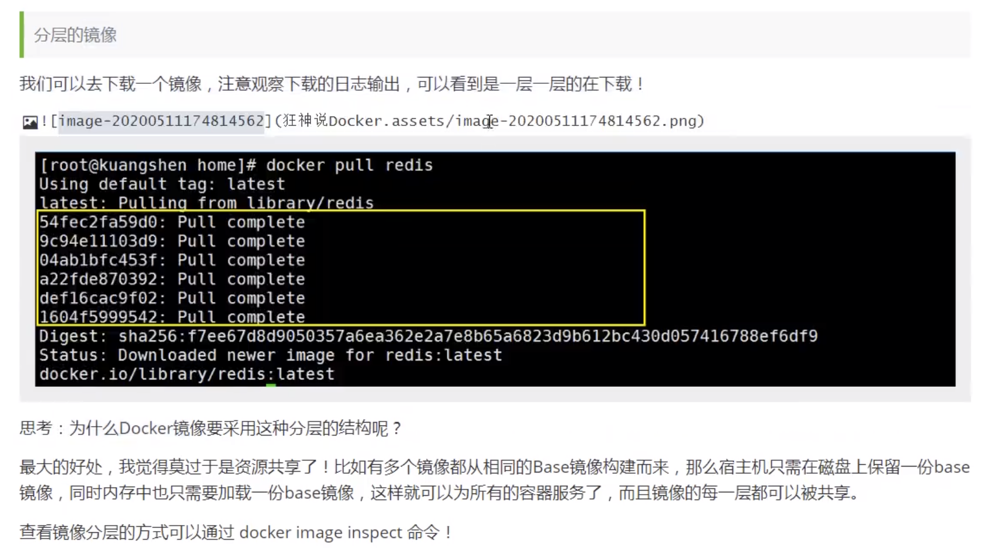
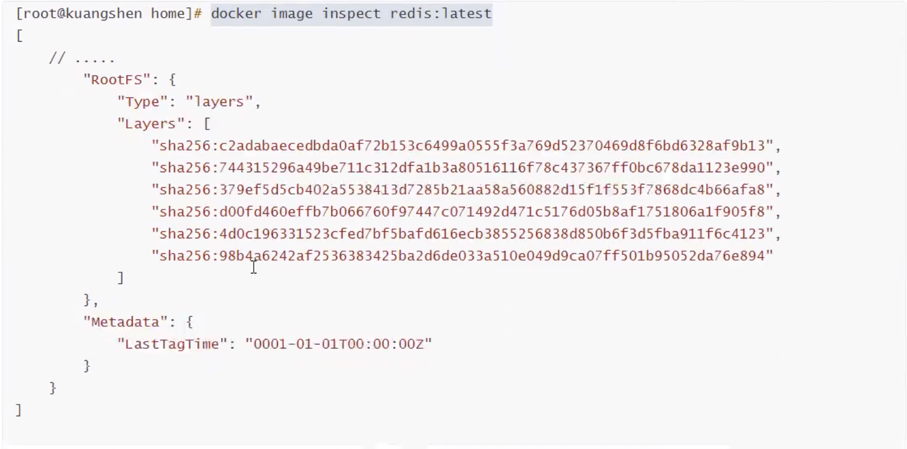
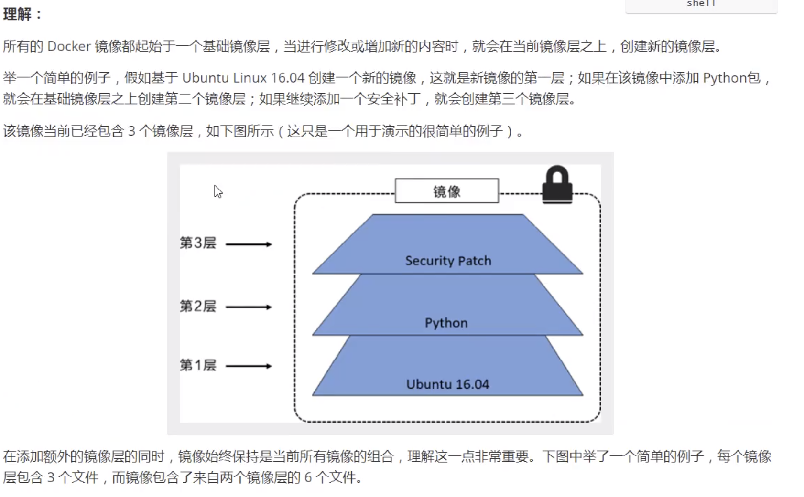
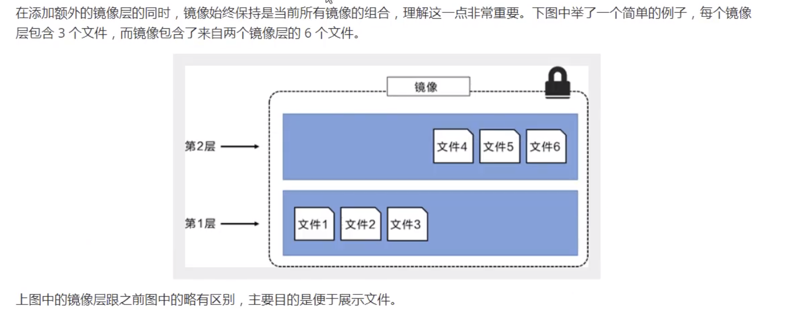
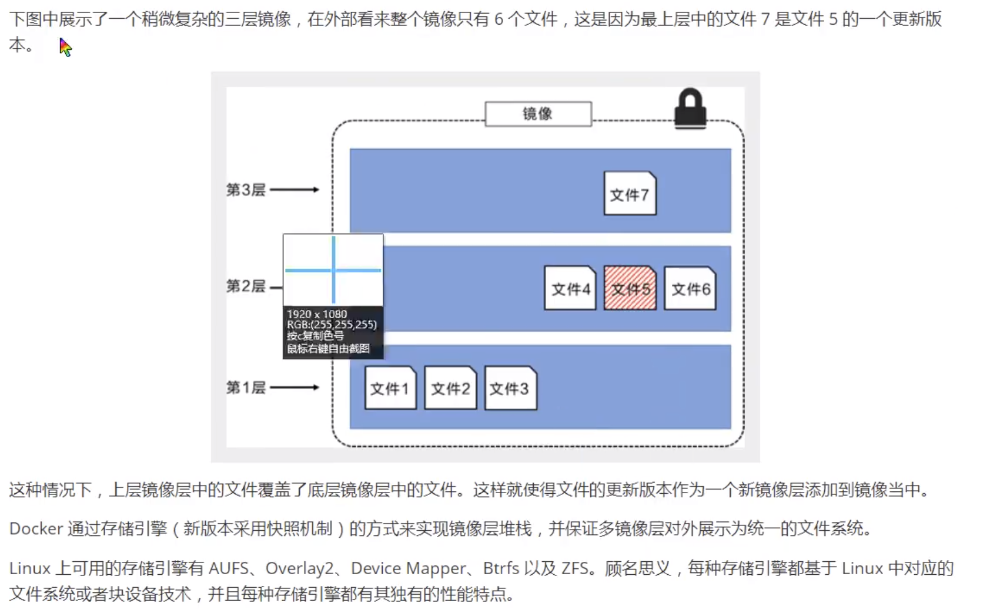
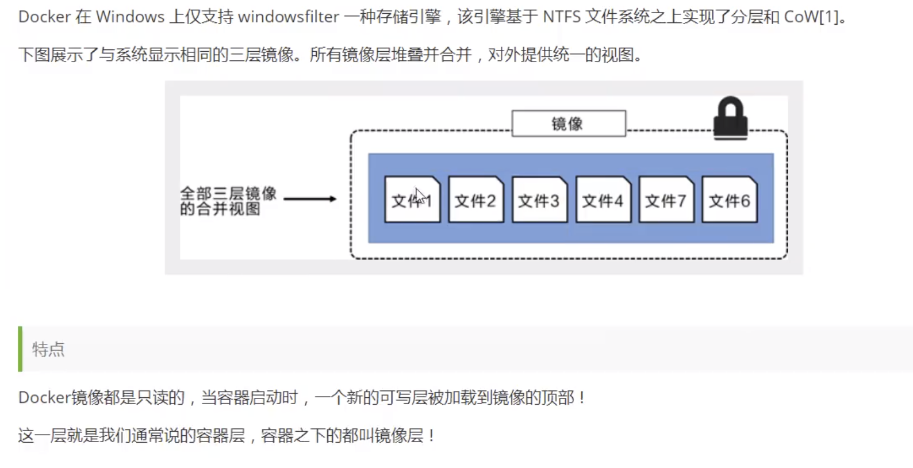
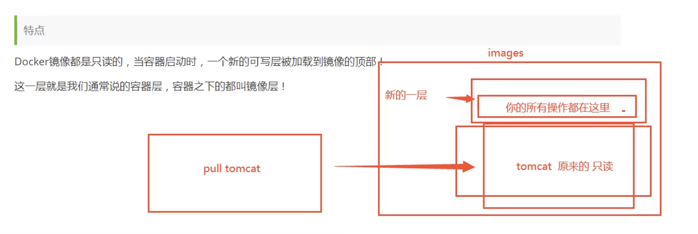
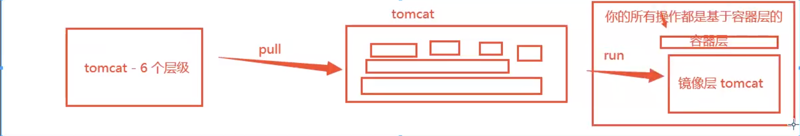

### 7.4 Commit镜像
>- `docker commit`，提交容器成为一个新的副本‘’；
>- `docker commit -m="提交的描述信息" -a="作者" 容器id 目标镜像名:[TAG]`，命令和git原理类似；
>-  **当你在原始的image上进行了一些相关的操作之后，就是在原始的image上添加了一层，然后就可以使用commit的方式进行镜像提交了，提交了之后通过`docker images`命令就可以看到这个新提交了的镜像了**；
>- 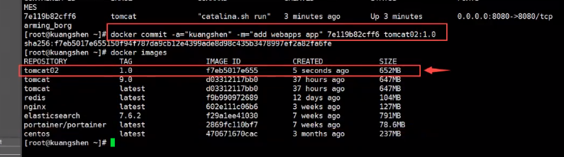
>- 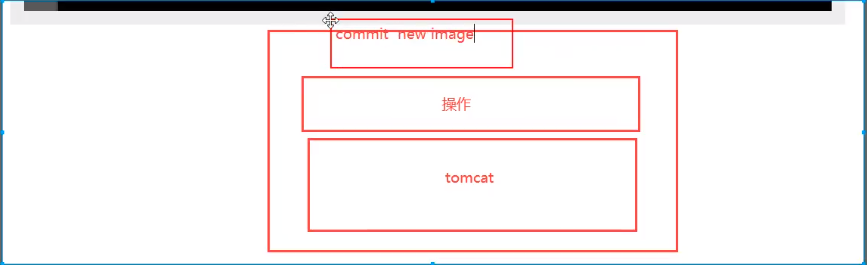
>- **上面的操作说明一个问题：如果你想要保存当前经过一些操作了之后的容器的状态，就可以通过commit来提交得到一个新的镜像，这个新的镜像就是包含了原始镜像以及你在原始镜像上做的一些操作了，这种方式类似虚拟机MV中的快照技术；**

### 8. 容器数据卷的使用
#### 8.1 什么是容器数据卷
>它是一种数据共享技术，能够使得Docker容器中产生的数据同步到本地，避免数据在容器被删除的时候也被一并删除，这就是卷技术，也就是目录的挂载，将我们容器内的目录挂载到Linux上面，最终使得容器内的数据能够持久化和同步操作。同时这个技术也能够使得数据在容器间能够共享；
>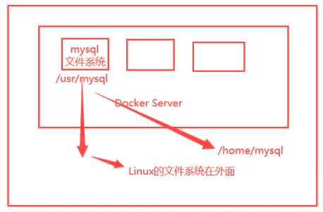

#### 8.2 使用数据卷
1. 方式一：直接使用命令来进行挂载 `-v`；
```
docker run -itd -v 主机目录:容器内目录 镜像名 /bin/bash
通过下面的命令可以测试，查看容器信息：
docker inspect 容器id
上述代码执行完毕后可以看到：
mounts：加载的文件系统
source：源地址就是当前你这个docker里面的地址目录
destination：是主机目录地址
```

### 9. Docker容器图像界面显示到宿主机
1. 在宿主机中安装xserver：`sudo apt install x11-xserver-utils`；
2. 许可所有用户都可访问xserver，注意加号前应有空格：`xhost +`；
3. 查看当前显示的环境变量值 (要在显示屏查看，其他ssh终端不行) ：`echo $DISPLAY`；
4. 使用image创建docker容器时，通过-v参数设置docker内外路径挂载，使显示xserver设备的socket文件在docker内也可以访问。并通过-e参数设置docker内的DISPLAY参数和宿主机一致。在创建docker容器时，添加选项如下：
>- `docker run -it --name 容器名 -h 容器主机名 --privileged=true  -v /tmp/.X11-unix:/tmp/.X11-unix -e DISPLAY=:0 镜像名或id /bin/bash`，例如：
>- `docker run -it --runtime=nvidia -v /home/stoner/DockerFile/:/workplace -h dockerHost --privileged=true -v /tmp/.X11-unix:/tmp/.X11-unix -e DISPLAY=:0 61412a1e6de9 /bin/bash`
>- 其中需要注意的是：**`--privileged=true`使用该参数，container内的root拥有真正的root权限。否则，container内的root只是外部的一个普通用户权限。privileged启动的容器，可以看到很多host上的设备，并且可以执行mount。甚至允许你在docker容器中启动docker容器。**

## 附录

> 1. [Docker快速入门总结笔记；](https://blog.csdn.net/huangjhai/article/details/118854733)
>2. [Docker容器图像界面显示到宿主机屏幕配置方法——挂载方式；](https://codeleading.com/article/86445074594/)
>3. [[docker]privileged参数；](https://blog.csdn.net/halcyonbaby/article/details/43499409)