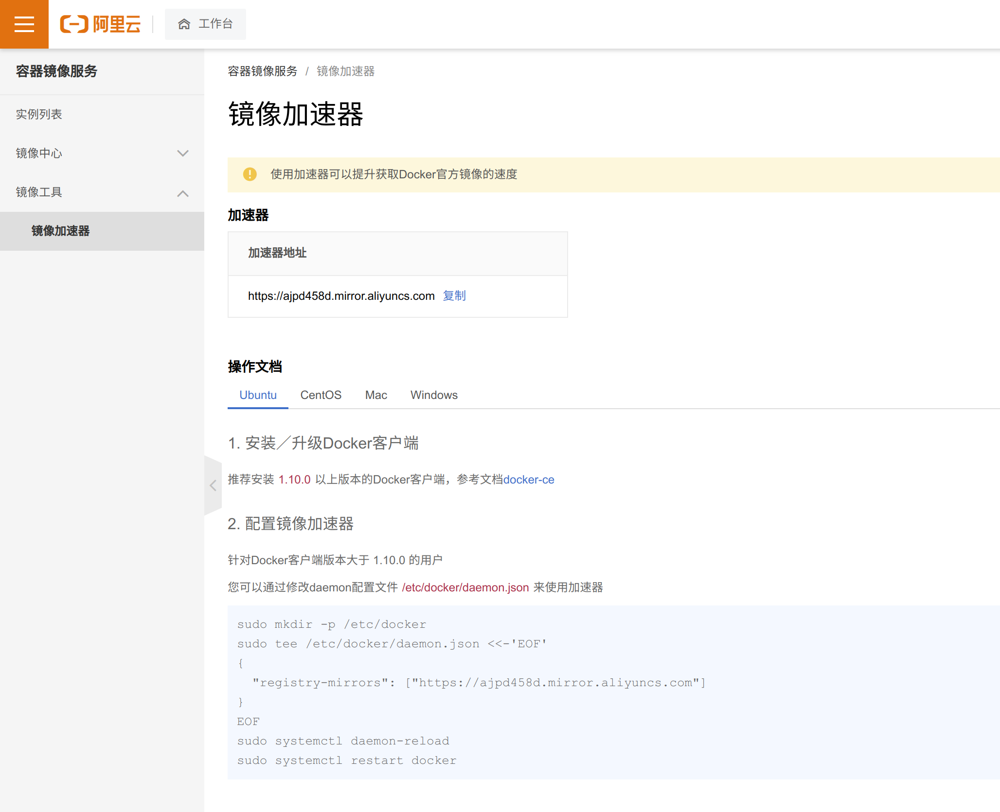
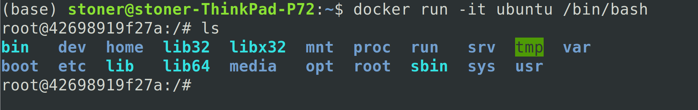

[TOC]
# Docker教程

## 1. Docker概述
1. [Ubuntu18.04 安装docker 教程一；](https://blog.zenghr.cn/passages/2020-02-24-docker-install.html)
2. [Ubuntu18.04 安装docker 教程二；](https://www.cnblogs.com/ellisonzhang/p/13902451.html)
3. **Docker核心思想：打包装箱、互相隔离、开发打包部署一套上线；**
4. **容器化技术不是模拟的一个完整的操作系统！容器与虚拟机的区别：**
>- 传统虚拟机会虚拟出一条硬件，运行一个完整的操作系统，然后在这个系统上安装和运行软件；
>- 容器内的应用直接运行宿主机的内容，容器是没有自己的内核的，也没有虚拟相应的硬件，所以很轻便，运行速度更快，相关的应用更快速的交付和部署；
>- 每个容器间是相互隔离的，每个容器内都有一个属于自己的文件系统，互不影响，更快捷的升级和扩缩容；
>- docker是内核级别的虚拟化，可以在一个物理机上运行很多的容器实例，服务器的性能够被压榨到极致；
5. **Docker架构图：**
>
6. **Docker相关名词：**
>-**镜像(image)：**docker镜像好比是一个模板，可以通过这个模板来创建容器服务，比如: tomcat服务-->run-->tomcat01容器(提供服务), 通过这个镜像可以创建多个容器(最终服务或者项目运行就是在这个容器中的)；
>-**容器(container)：**Docker利用容器技术，独立运行一个或者一组应用，通过镜像来创建。目前可以把这个容器理解为简易的Linux系统；
>-**仓库(repository)：**仓库就是存放镜像的地方，仓库分为共有仓库和私有仓库，例如DockerHub或者国内的阿里云等都有容器服务；
7. **docker默认工作路径：**`sudo ls /var/lib/docker/`
8. **阿里云镜像加速：**
>
9. **Docker运行一个镜像的步骤：**
>
10. **Docker是怎么工作的？**
>Docker是一个Client-Server结构的系统，Docker的守护进程是运行在宿主机上的，通过Socket从客户端访问，DockerServer接收到DockerClient的指令后就会执行这个命令！
>
11. **Docker为什么比VM快？**
>- Docker有着比虚拟机更少的抽象层；
>
>- Docker利用的是宿主机的内核，VM则需要自己建立虚拟机操作系统，所以新建一个容器的时候，不需要像虚拟机一样重新加载一个操作系统内核，避免引导，省略了这个复杂的过程，速度是秒级的；
12. **Docker服务的启动与停止：**
>- `sudo systemctl start docker`，启动docker；
>- `sudo systemctl stop docker`，停止docker；
>- `sudo systemctl restart docker`，重启docker；
>- `sudo systemctl status docker`，查看docker状态；
>- `sudo systemctl enable docker`，开机启动docker；

## 2. 镜像的基本命令
### 2.1 帮助命令
>- `docker version` #显示docker的版本信息
>- `docker info` # 显示docker的系统信息，包括镜像和容器的数量
>- `docker command_line --help` # 帮助命令
>-**帮助文档地址：**https://docs.docker.com/engine/reference/commandline/
### 2.2 镜像命令
1. `docker images` 查看所有本地主机上的镜像
>
>- **REPOSITORY:**镜像的仓库源；
>- **TAG:**镜像的版本标签信息；
>-**IMAGE ID:**镜像的id；
>-**CREATED:**镜像创建时间；
>-**SIZE:**镜像的大小；
>-`-a` 可选项，列出所有镜像；
>-`-q` 可选项，只显示镜像的id；
2. `docker search` 搜索镜像
>`--filter=STARS=3000` # 可选项，搜索镜像的STARTS大于3000的；
3. `docker pull` 下载镜像
>- **下载镜像：**`docker pull 镜像名 [:tag]`
>- 如果不指定`tag`则默认下载的是**latest**；
>- 
>- **pull complete那一行是分层下载，是docker images的核心，联合文件系统**；
>- **Digest那一行是该镜像的签名信息，防伪；**
>- `docker.io/library/mysql:latest`是**image**的真实地址，因此**`docker pull mysql`**与**`docker pull docker.io/library/mysql:latest`**是等价的；
>- **如果要下载指定版本的话，可以在DockerHub中找到要下载的镜像有什么版本，然后在拉取镜像的时候进行版本指定，例如：`docker pull mysql:5.7`**
>- 
>- **可以看到分层下载的好处就是，下载不同的版本的时候，之前下载的版本的image中有些跟现在下载的版本的image中有共用的内容的时候就不用再下载了，这就是联合文件系统**；
4. `docker rmi`删除镜像
>- `docker rmi 镜像名/镜像id`，删除单个指定的容器
>- `docker rmi -f 镜像名/镜像id`，其中`-f`代表的是将要删除的image完全删除干净，后面可以接多个镜像，就会删除多个指定的镜像；
>- `docker rmi -f $(docker images -aq)`，递归的删除所有的镜像，其中`$(docker images -aq)`就是查找到所有的**images**；

## 3. 容器的基本命令
1. **需要注意的是有了镜像才能够创建容器，可以下载一个ubuntu系统来测试学习；**
>`docker pull ubuntu`
2. **新建容器并启动：**
>`docker run [可选参数] image`
>- `--name="Name"` # 容器名字，例如：tomcat01、tomcat02用以区分不同的容器；
>- `-d` #以后台方式运行；
>- `-it` # 使用交互方式运行，进入容器查看内容；
>- `-p` # 指定容器的端口, `-p 主机端口:容器端口(常用)`，这种方式就将外部主机的端口与容器的端口进行绑定(映射)，从而通过主机的被绑定的端口可以访问容器的端口；
>- `-P`# 随机指定端口；
3. **启动并以交互模式(`-it`)进入容器：`docker run -it ubuntu /bin/bash`**
>
>此时开启的ubuntu容器与外部的没有任何关系，属于基础版本，很多命令并不完善
4. **查看当前有哪些容器是在运行的：`docker ps`，查看现在正在运行的容器+曾经有哪些容器运行过：`docker ps -a`；要显示最近创建的容器的时候可以使用`docker ps -a -n=xxx`；只显示容器的编号使用`-q`**
>
>**个人理解(不一定对)：容器和镜像的关系有点像进程和代码的关系，代码是一堆固定的死的内容，当代码运行起来了之后变成了一个独立的进程，而这个进程除了包含代码本身之外，还包含了运行这个进程所需的一些资源，例如：内存、键盘、鼠标等，而容器和镜像的关系也是类似如此，镜像是死的，镜像运行起来了之后(**`docker run xxximage`**)才变成了容器，而容器除了镜像本身之外还包含了其他资源；**
5. **退出容器：**
>- `exit` #退出容器并停止容器；
>- `ctrl + P + Q` # 不停止容器的情况下退出当前容器(不分大小写)；
>- 
6. **删除容器：**
>- `docker rm 容器id/容器名称`，删除单个指定的容器，但是不能删除正在运行的容器，如果要强制删除使用`rm -f`的方式进行删除；
>- `docker rm -f $(docker ps -aq)`，递归删除所有容器；
>- `docker ps -a -q | xargs docker rm`，以管道的方式一个一个的进行删除；
7. **启动和停止容器：**
>- `docker start 容器id`，启动容器；
>- `docker restart 容器id`，重启容器；
>- `docker stop 容器id`，停止当前正在运行的容器；
>- `docker kill 容器id`，强制停止当前正在运行的容器；
>- **需要注意的是：`docker run`只有在第一次运行的时候，将镜像放到容器中，以后再次启动这个容器的时候，只需要使用命令`docker start`就可以了**；

## 4. 日志、元数据以及进程的查看
1. `docker run -d xxximages`，后台启动容器；
>需要注意：通过后台启动的方式发现`docker ps`下该容器停止了。这是一个常见的坑：docker容器通过后台运行，就必须要有一个前台进程，当docker发现没有前台的进程的时候就会自动停止当前这个启动的容器；这里的解决办法是在最后加上`/bin/bash`，`/bin/bash`的作用是表示载入容器后运行**bash** ,**docker**中必须要保持一个进程的运行，要不然整个容器启动后就会马上**kill itself**，这个`/bin/bash`就表示启动容器后启动**bash**；
2. `docker logs`，查看日志；
>- `docker logs -f -t --tail nums 容器id`；显示容器相关日志，其中`--tail nums`代表要显示的日志条数；
3. **查看容器中的进程信息：**
>- `docker top 容器id`，查看某个容器的进程信息
>- 
4. **查看镜像元数据：**
>- `docker inspect 容器id`，查看容器的元数据
>- 

## 5. 进入容器的命令和拷贝命令
1. 方式一：`docker exec -it 容器id bashshell`
>我们通常容器都是使用后台方式运行的，需要进入容器，修改一些配置；
>
2. 方式二：`docker attach 容器id`
>- `docker exec`进入容器后会开启一个新的终端，可以在里面操作(常用)；
>- `docker attach`进入容器正在执行的终端，不会启动新的进程；
3. **从容器拷贝文件到主机：**
>- `docker cp 容器id:容器内文件路径 主机目的路径`，需要注意的是容器此时是否启动是不重要的，因为容器中的文件是不会消失的，除非容器被删除；
>- 
>- **拷贝是一个手动的过程，未来可以使用-v卷的技术实现自动同步。**

## 6. 命令小结
>
>
>
>
>**需要注意的是我们一般在开启一个容器的时候都是采用的后台启动，在停止了这个容器之后还能再查到这个容器，如果加上`--rm`**这可选参数之后，可以使得该容器在测试完毕之后即被删除；

## 7. 镜像原理之联合文件系统
### 7.1 什么是镜像
镜像是一种轻量级、可执行的独立软件包，用来打包软件运行环境和基于运行环境开发的软件，它包含运行某个软件所需要的所有内容，包括代码，运行时（一个程序在运行或者在被执行的依赖）、库，环境变量和配置文件。
如何获取一个镜像：
- **从远程仓库下载；**
- **从他人那里拷贝一份；**
- **自己制作一个镜像DockerFile；**
### 7.2 Docker镜像加载原理
#### 7.2.1 UnionFS(联合文件系统)

#### 7.2.2 Docker镜像加载原理

>在docker中加载的os是一个精简的os，它只提供rootfs，底层直接使用的是host的kernel；
### 7.3 分层理解

### 7.4 Commit镜像

## 附录
>1. [Docker快速入门总结笔记；](https://blog.csdn.net/huangjhai/article/details/118854733)

